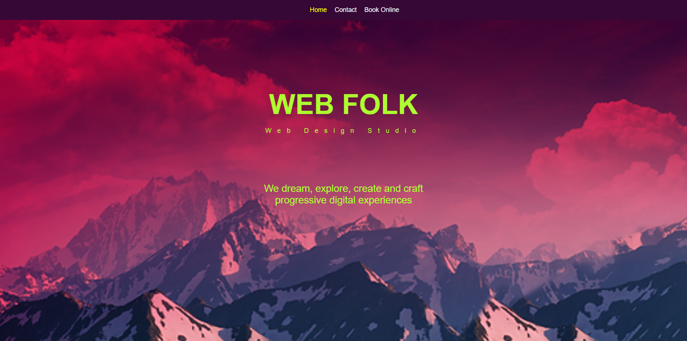

# 🌐 Web Folk - Multi Page Website

موقع ويب احترافي مكوّن من 3 صفحات (Home - Contact - Book Online)  
مصمم بالكامل باستخدام **HTML** و **CSS** فقط، ويعرض خدمات استوديو ويب وهمي.

---

## 🌍 رابط المشروع الحي

[🔗 جرّب الموقع الآن](https://antonious-sameh.github.io/web-folk-website/)

> ✳️ استبدل `your-username` باسم حسابك على GitHub

---

## 🖼️ صورة للموقع

---

## 📄 صفحات المشروع

| الصفحة        | الوصف |
|---------------|-------|
| `index.html`  | الصفحة الرئيسية: مقدمة، الصور، معلومات عن الفريق |
| `contact.html`| صفحة التواصل: نموذج للتواصل ومعلومات الاتصال |
| `book.html`   | صفحة الحجز: عرض الخدمات والحجز |

---

## 🛠️ التقنيات المستخدمة

- ✅ HTML5
- ✅ CSS3 (بأنماط مخصصة ومتقدمة)
- ❌ لا يستخدم JavaScript
- 🖼️ صور خلفية وتنسيق Flex/Float

## ✨ المميزات

- 🔸 تصميم متجاوب
- 🔸 صور جذابة ومرتبة في جريد
- 🔸 تنقل بين الصفحات بسلاسة
- 🔸 فورم تواصل
- 🔸 عرض فريق العمل والخدمات
